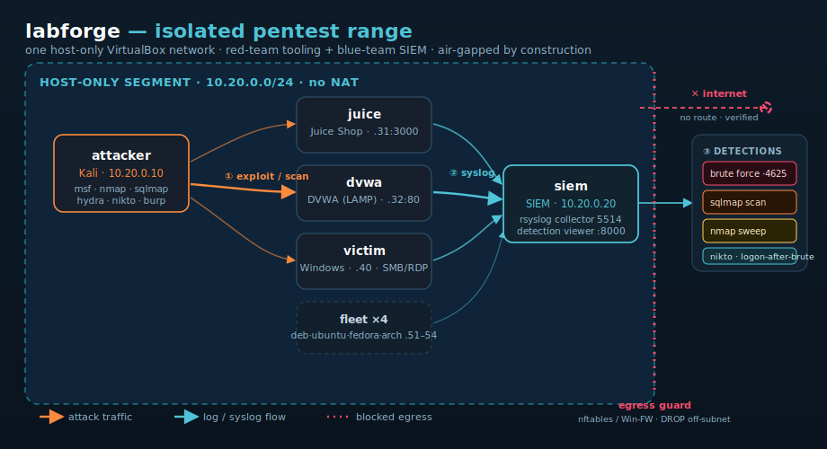

# labforge

**One command → an isolated, air-gapped pentest range with a detection SIEM.**

Infrastructure-as-code that spins up a *host-only, no-internet* security lab in
Vagrant + VirtualBox — a Kali attacker, deliberately-vulnerable OWASP web
targets, a Windows victim, a multi-distro Linux fleet, and a free, **Splunk-style
central SIEM with a built-in detection engine** — all provisioned by Ansible.
Red team on one side, blue team watching the logs on the other, and an isolation
gate that fails loudly if anything can reach the internet.

[](https://github.com/xj16/labforge/actions/workflows/ci.yml)
[](siem/)


[](LICENSE)

> 🔍 **[Try the SIEM detection dashboard in your browser — no VMs](demo/index.html)**
> — the exact detection engine the lab ships, running on a canned attack corpus.

> ⚠️ **Strictly educational and defensive.** This lab is air-gapped and meant for
> practicing security skills on machines *you own*. **Read
> [ETHICS.md](ETHICS.md) before you run anything.**

```bash
git clone https://github.com/xj16/labforge && cd labforge
scripts/lab-up.sh --minimal      # attacker + siem + Juice Shop; auto-verifies isolation
```

`lab-up.sh` provisions the range and then runs a multi-vector air-gap check
automatically — it won't print "ready" if any box can reach the internet.

<p align="center">
  
</p>

---

## Why

Learning offensive security responsibly needs a target range you own and can
break freely. Spinning one up by hand — Kali, vulnerable apps, a victim box, and
somewhere to watch the logs — is fiddly and easy to get *wrong* in dangerous
ways (a stray NAT interface and your "lab" is now scanning the internet).

labforge makes that range **reproducible, isolated by construction, and
disposable**: one command up, one command down, and an isolation checker that
fails loudly if anything leaks. It also pairs the red-team tooling with a
**blue-team** feedback loop — a centralized SIEM so you can watch your own
attacks land in the logs and learn detection.

## What you get

| Machine   | IP          | What it is |
|-----------|-------------|------------|
| attacker  | 10.20.0.10  | **Kali Linux** — Metasploit, Wireshark/tshark, Burp Suite, nmap, sqlmap, hydra, nikto, plus staged cheat-sheets and a recon helper |
| siem      | 10.20.0.20  | **Central logging / SIEM** — rsyslog collector + a dependency-free web log viewer (`:8000`); optional real-Splunk path |
| juice     | 10.20.0.31  | **OWASP Juice Shop** — the reference vulnerable web app (`:3000`) |
| dvwa      | 10.20.0.32  | **DVWA** on a LAMP stack — progressive difficulty (`admin`/`password`) |
| victim    | 10.20.0.40  | **Windows 10 victim** (opt-in) — SMB + RDP, weak accounts, Event-Log forwarding |
| deb/ubuntu/fedora/arch | 10.20.0.51-54 | **Multi-distro fleet** — Debian 12, Ubuntu 22.04, Fedora 39, Arch; baseline-hardened and forwarding logs |

Full address plan and diagram: [docs/topology.md](docs/topology.md).

## Features

- **One command up/down.** `scripts/lab-up.sh` (or `make up`) → the whole range;
  `vagrant destroy -f` → gone.
- **Isolated by construction.** Single VirtualBox host-only network, no NAT on
  lab NICs, plus an `nftables` / Windows-Firewall egress guard as defence-in-
  depth. `scripts/verify-isolation.sh` actively proves it.
- **Real provisioning, not a scaffold.** Idempotent Ansible roles install and
  configure every service for real (Metasploit DB init, Juice Shop as a systemd
  service, DVWA seeded end-to-end, rsyslog central collector, per-host log
  files, a working web log viewer).
- **Blue-team detection lab, built in.** Every box forwards syslog to the SIEM
  (Linux over reliable TCP, the Windows victim over UDP — the collector accepts
  both). The SIEM isn't just a log viewer: a stdlib-only **detection engine**
  flags brute force, port sweeps, and sqlmap/nikto scans automatically, ranked
  by severity and mapped to MITRE ATT&CK, with an alert banner and highlighted
  evidence at `http://10.20.0.20:8000`. **[See it live, no VMs →](demo/index.html)**
- **Red-team ready.** Kali comes pre-loaded with a `scan-lab.sh` recon script, a
  Metasploit `recon.rc` resource file, non-root packet capture, and a target
  cheat-sheet.
- **Data-driven topology.** Edit `lab.yml`, not Ruby. Toggle the fleet, the
  Windows victim, or a minimal fast lab with env switches.
- **100% free & offline-capable.** No paid services, no API keys. Community
  Vagrant boxes and open-source tooling only. Optional real-Splunk path if you
  have your own license.

## Requirements

- [VirtualBox](https://www.virtualbox.org/) 7.x
- [Vagrant](https://www.vagrantup.com/) 2.3+
- ~8 GB free RAM for the minimal lab, ~16 GB for the full fleet, and disk for the
  boxes
- To provision from the host: Ansible (Linux/macOS/WSL). On Windows without WSL,
  use `ansible_local` — see [Provisioning on Windows](#provisioning-on-windows).

First `vagrant up` downloads the community boxes; after that it's cached.

## Quick start

```bash
# fastest: attacker + siem + Juice Shop
scripts/lab-up.sh --minimal

# the full range (targets + multi-distro fleet)
scripts/lab-up.sh

# add the Windows victim
scripts/lab-up.sh --windows

# what's running + where to click
scripts/lab-status.sh

# prove the lab is air-gapped (should report every box isolated)
scripts/verify-isolation.sh
```

Or via `make`: `make up`, `make minimal`, `make windows`, `make status`,
`make isolation`, `make destroy`.

Then:

- **SIEM log viewer** → <http://10.20.0.20:8000>
- **Juice Shop** → <http://10.20.0.31:3000>
- **DVWA** → <http://10.20.0.32/> (`admin` / `password`)
- **Attacker** → `vagrant ssh attacker`, then `cd ~/labforge && ./scan-lab.sh`

Walk the whole thing end-to-end in [docs/walkthrough.md](docs/walkthrough.md).

## How it works

```
Vagrantfile (reads lab.yml)
  └─ per-VM: host-only NIC on 10.20.0.0/24, no NAT, promisc for sniffing
  └─ shell bootstrap (ensure python3)
  └─ Ansible provisioner runs ansible/site.yml
         common       → baseline pkgs, /etc/hosts, nftables egress guard
         splunk       → rsyslog central collector + web log viewer (on siem)
         log_forwarder→ point every client's rsyslog at the SIEM
         kali         → offensive tooling, msfdb, capture rights, cheat-sheets
         juiceshop    → OWASP Juice Shop as a systemd service
         dvwa         → LAMP + DVWA, config templated, DB seeded
  Windows victim → windows/provision-victim.ps1 (SMB/RDP, weak users, syslog)
```

Provisioning order matters — the SIEM comes up before clients try to forward, so
`site.yml` sequences the plays accordingly.

The SIEM's detection engine and viewer live in [`siem/`](siem/) as a real,
tested Python package (`labforge_siem`) — the same code the tests cover, the
Ansible role deploys, and the browser demo runs. That means the blue-team half
isn't a scaffold: it's exercised end-to-end by CI.

## Live demo (no VMs)

The whole SIEM dashboard runs in the browser against a canned attack corpus:
**[demo/index.html](demo/index.html)**. Host grid, per-host drilldown with
highlighted attack evidence, cross-host search, a severity chart, and the
automatic detections — all client-side, zero dependencies. The corpus and its
findings are generated from the real engine (`python demo/build_demo.py`), so
the demo can't disagree with the lab. Run it locally with `make demo`.

## Testing

The SIEM package ships a flagship pytest suite (parser, path-traversal-safe
store, every detection rule, and the live HTTP server) at ~95% line+branch
coverage, gated in CI.

```bash
cd siem
pip install -r requirements-dev.txt
make -C .. coverage          # or: coverage run -m pytest && coverage report
```

VirtualBox can't run in GitHub Actions, so CI proves everything that *can* be
proven without a hypervisor: the detection engine and viewer (pytest +
coverage), Ansible (ansible-lint + syntax check), shell (ShellCheck), and the
Windows scripts (PSScriptAnalyzer).

### Provisioning on Windows

The default flow runs Ansible **from the host**, which needs a POSIX Ansible
(Linux, macOS, or WSL). If you're on native Windows without WSL, switch the
Vagrantfile's `config.vm.provision "ansible"` block to `ansible_local` (runs
Ansible *inside* a guest — no host Ansible required). The roles are unchanged;
only where the control node runs differs.

## Configuration

- **Topology:** `lab.yml` — subnet and per-host addresses (the single source of
  truth; mirrored in the Vagrantfile and the Ansible inventory).
- **Global vars:** `ansible/group_vars/all.yml` — SIEM host/port, isolation
  toggle, baseline packages.
- **Target vars:** `ansible/group_vars/targets_web.yml` — Juice Shop version,
  DVWA credentials and security level.
- **Env toggles:** `LABFORGE_MINIMAL`, `LABFORGE_FLEET`, `LABFORGE_WINDOWS`
  (see [docs/topology.md](docs/topology.md)).

## Documentation

- [ETHICS.md](ETHICS.md) — legal/ethics note. **Read first.**
- [docs/topology.md](docs/topology.md) — network map and address plan
- [docs/walkthrough.md](docs/walkthrough.md) — a guided first hour
- [docs/wireshark.md](docs/wireshark.md) — capturing lab traffic
- [docs/burp.md](docs/burp.md) — proxying targets through Burp Suite
- [docs/siem.md](docs/siem.md) — centralized logging, the detection rules, real-Splunk path
- [siem/README.md](siem/README.md) — the SIEM package internals + how to test it
- [CHANGELOG.md](CHANGELOG.md) — release history (Keep a Changelog)

## Tech stack

**Vagrant** + **VirtualBox** (IaC / virtualization) · **Ansible** (provisioning,
6 roles) · **Bash** & **PowerShell** (bootstrap, helpers, Windows victim) ·
**Kali Linux** with **Metasploit**, **Wireshark**, **Burp Suite** (red team) ·
**OWASP** Juice Shop & DVWA (targets) · **rsyslog** (TCP+UDP) + a stdlib-only
**Python detection engine + web viewer**, **Splunk**-compatible (blue team) ·
**pytest** + **coverage** (95%+, gated) · **nftables** (isolation) ·
**GitHub Actions** (pytest/coverage + ansible-lint + yamllint + ShellCheck +
PSScriptAnalyzer).

## Repository layout

```
labforge/
├── Vagrantfile              # data-driven multi-machine definition
├── lab.yml                  # topology source of truth
├── Makefile                 # convenience targets (up, test, coverage, demo, verify)
├── ansible/
│   ├── site.yml             # top-level playbook
│   ├── ansible.cfg
│   ├── requirements.yml     # Galaxy collections
│   ├── inventory/hosts.ini
│   ├── group_vars/
│   └── roles/               # common, splunk, log_forwarder, kali, juiceshop, dvwa
├── siem/                    # the SIEM viewer + detection engine (tested Python pkg)
│   ├── labforge_siem/       # parser · detections · store · app · corpus
│   ├── tests/               # flagship pytest suite (95%+ coverage)
│   └── run_logviewer.py     # entrypoint deployed to the SIEM box
├── demo/                    # VM-free in-browser SIEM demo (index.html + data.js)
├── windows/                 # Windows victim provisioner + syslog forwarder
├── scripts/                 # bootstrap, lab-up, lab-status, verify-isolation
└── docs/                    # topology, walkthrough, wireshark, burp, siem, architecture.svg
```

## Contributing

Issues and PRs welcome — for **defensive/educational** improvements only (new
distros in the fleet, more Ansible hardening, detection content for the SIEM).
Exploits or anything intended to attack systems the operator doesn't own are out
of scope; see [ETHICS.md](ETHICS.md).

## License

[MIT](LICENSE) © 2026 xj16
